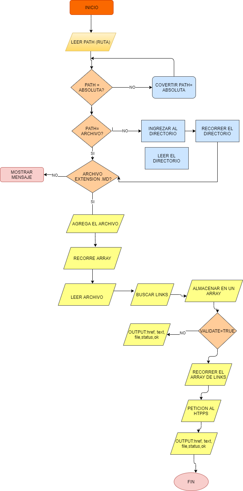
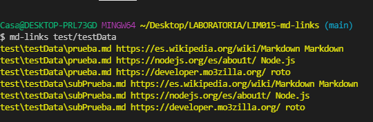
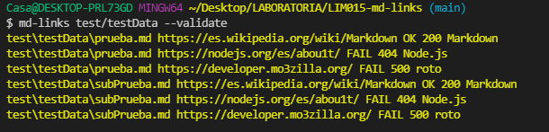
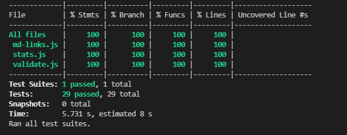

# Markdown Links

## Índice

- [1. Preámbulo](#1-preámbulo)
- [2. Resumen del proyecto](#2-resumen-del-proyecto)
- [3. Plan de acción](#3-Plan-de-acción)
- [4. Guia de uso](#4-Guia-de-uso)
- [5. Instalacion](#5-Instalacion)
- [6. Checklist](#6-checklist)
- [7. Objetivos de aprendizaje](#7-Objetivos-de-aprendizaje)
---

## 1. Preámbulo

[Markdown](https://es.wikipedia.org/wiki/Markdown) es un lenguaje de marcado
ligero muy popular entre developers. Es usado en muchísimas plataformas que
manejan texto plano (GitHub, foros, blogs, ...), y es muy común
encontrar varios archivos en ese formato en cualquier tipo de repositorio
(empezando por el tradicional `README.md`).

Estos archivos `Markdown` normalmente contienen _links_ (vínculos/ligas) que
muchas veces están rotos o ya no son válidos y eso perjudica mucho el valor de
la información que se quiere compartir.

Dentro de una comunidad de código abierto, nos han propuesto crear una
herramienta usando [Node.js](https://nodejs.org/), que lea y analice archivos
en formato `Markdown`, para verificar los links que contengan y reportar
algunas estadísticas.

## 2. Resumen del proyecto

En este proyecto creamos una herramienta de línea de comando (CLI) que permite extraer links dentro de archivos markdown, evalua su estatus y presenta estadísticas de los mismos.

## 3. Plan de acción

Como parte de la planificación de este proyecto, se elaboró un plan de acción en Github Projects considerando un milestone por cada sprint y los issues necesarios para poder hacer
seguimiento del progreso de acuerdo al tiempo estipulado, además se usó la plataforma de [diagrams-app](https://app.diagrams.net/) para elaborar el diagrama de flujo con los pasos necesarios para culminar el proceso, el cual presentamos a continuación:

[Diagrama de flujo](https://raw.githubusercontent.com/JackelinGM/LIM015-md-links/main/src/imagen/Untitled%20Diagram.drawio.png)


## 4. Guía de uso

La librería se puede ejecutar de la siguiente manera a través de la terminal:

`md-links <path-to-file> [options]`

Por ejemplo:

```sh
$ md-links ./some/example.md
./some/example.md http://algo.com/2/3/ Link a algo
./some/example.md https://otra-cosa.net/algun-doc.html algún doc
./some/example.md http://google.com/ Google
```

#### Options

##### `-v` o `--validate`

Si pasamos la opción `-v` o `--validate`, el módulo hace una petición HTTP para
averiguar si el link funciona o no. Si el link resulta en una redirección a una
URL que responde ok, entonces consideraremos el link como ok.

Por ejemplo:

```sh
$ md-links ./some/example.md --validate
./some/example.md http://algo.com/2/3/ ok 200 Link a algo
./some/example.md https://otra-cosa.net/algun-doc.html fail 404 algún doc
./some/example.md http://google.com/ ok 301 Google
```

Vemos que el _output_ en este caso incluye la palabra `ok` o `fail` después de
la URL, así como el status de la respuesta recibida a la petición HTTP a dicha
URL.


##### `-s` o `--stats`

Si se pasa la opción `-s` o `--stats` el output (salida) será un texto con estadísticas
básicas sobre los links.

```
$ md-links ./some/example.md --stats
Total: 3
Unique: 3
```


También es posible combinar `--stats` y `--validate` para obtener estadísticas que
necesiten de los resultados de la validación.

```
$ md-links ./some/example.md --stats --validate
Total: 3
Unique: 3
Broken: 1
```


## 5. Instalación

Para instalar la librería use el comando:

`npm install md-links-mel09`,

`npm install --global md-links-mel09` o

`npm install --save-dev md-links-mel09`        


Para desinstalar use el comando:

`npm uninstall md-links-mel09`

## 6. Checklist

### General

- [x] Puede instalarse via `npm install md-links-mel09`

## 7. Objetivos de aprendizaje
 
### Objetivos de aprendizaje pendientes
- [x] Creación y consumo de promesas

### Javascript
- [X] Uso de callbacks
- [x] Consumo de Promesas
- [x] Creacion de Promesas
- [x] Modulos de Js
- [x] Recursión

### Node
- [x] Sistema de archivos
- [x] package.json
- [x] crear modules
- [x] Instalar y usar modules
- [ ] npm scripts
- [x] CLI (Command Line Interface - Interfaz de Línea de Comando)

### Testing
- [x] Testeo de tus funciones
- [x] Testeo asíncrono
- [ ] Uso de librerias de Mock
- [x] Testeo para multiples Sistemas Operativos



### Buenas prácticas de desarrollo
- [x] Modularización
- [x] Nomenclatura / Semántica
- [ ] Linting

***
**Autor:** Melissa Gutierrez Montalban.  
**Generación:** LIM015 Laboratoria Perú.
